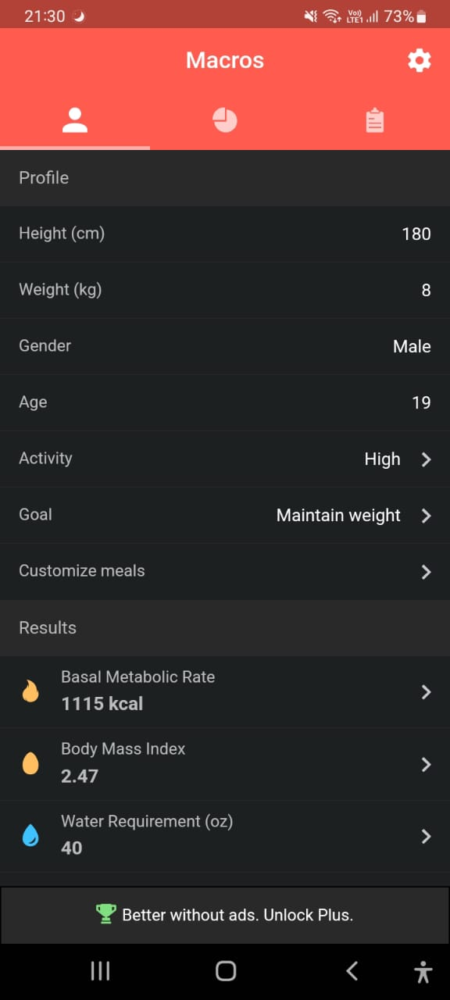
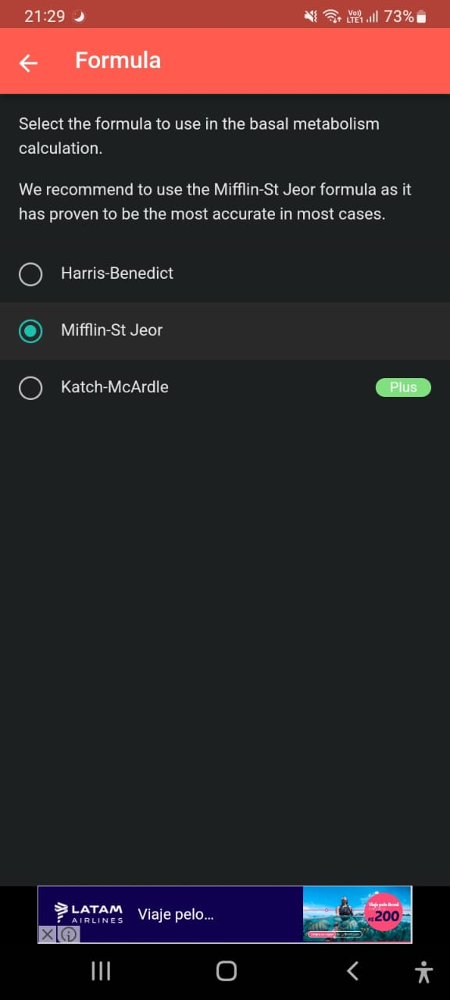
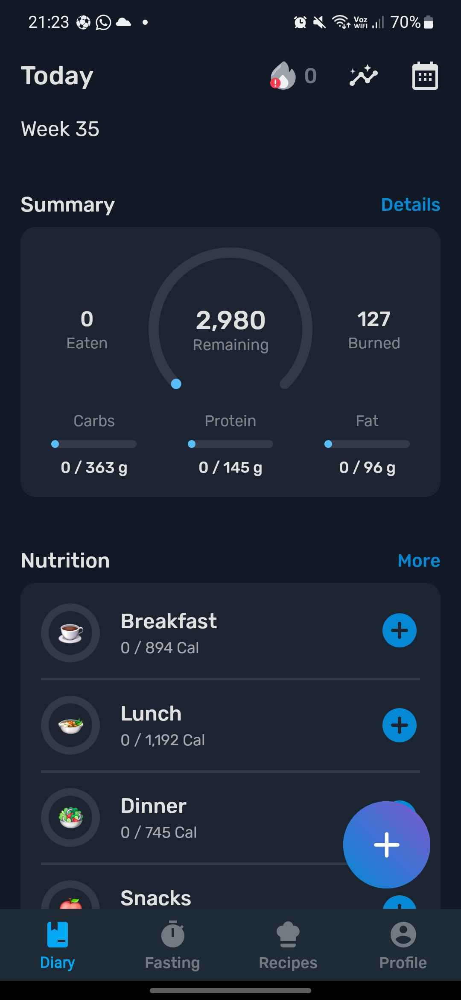
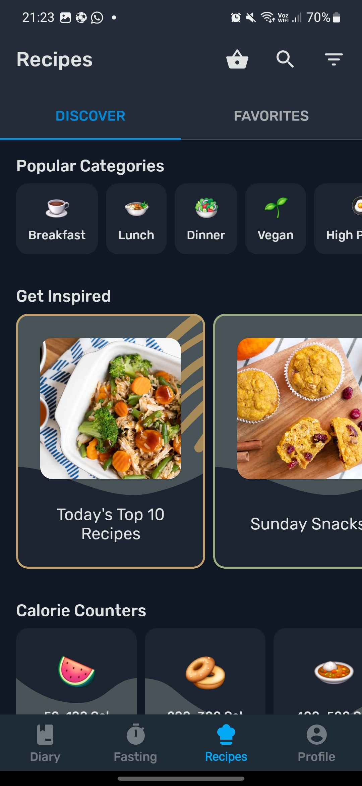
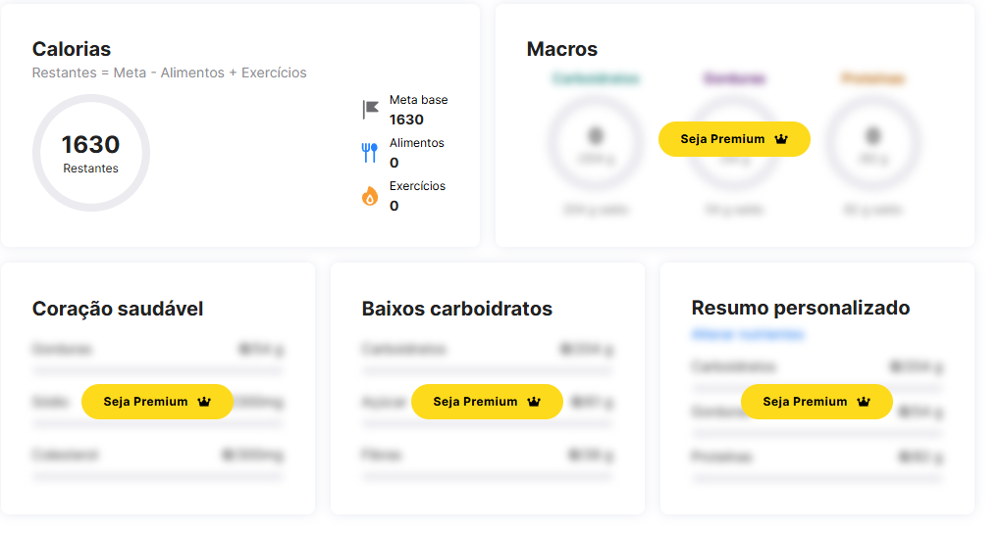
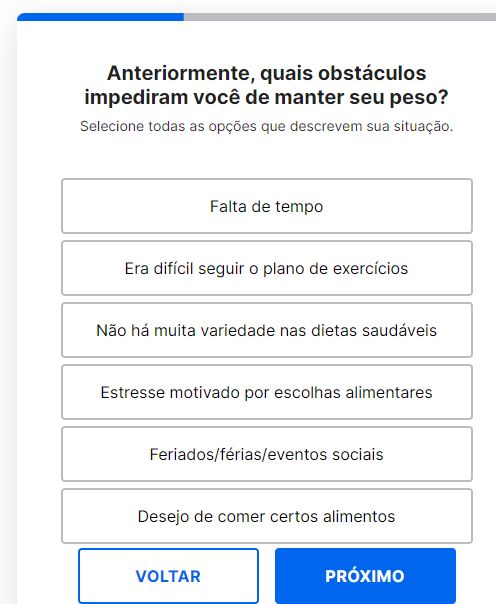

# Elicitação de Requisitos - Avaliação 3

## BRAINSTORMING:

### Para a realização desta técnica de elicitação de requisitos, nos reunimos e anotamos neste documentos as ideias de novas funcionalidades que surgiram durante a conversa.

#### Requisitos

- O usuário pode manter uma conta

- O sistema deve oferecer dicas para melhorar o condicionamento físico do usuário, baseado em métricas fornecidas pelo usuário

- O usuário pode armazenar informacões sobre o que ele consumiu no dia e manter o tracking das calorias e macronutrientes ingeridos

- O sistema deve disponibiizar alarmes para atividades importantes, como: hora de ir para a academia e hora de comer

- O sistema deve manter um tracking do streak de dias que o usuario praticou exercicios, como no Duolingo

- O sistema deve apresentar sugestões de treinos para a academia, baseado nos objetivos do usuário

- O sistema deve proporcionar sugestões de receitas ou de alimentos dependendo do que o usuário consumiu recentemente

- O usuário pode criar grupos com outros usuários, mandar mensagens e compartilhar treinos, receitas, dietas...

- O sistema deve armazenar a quantidade de litros de água que o usuário bebeu e mostrar um gráfico de consumo de água no eixo y e dias no eixo x

- O sistema deve aproximar as vitaminas ingeridas pelo usuário, baseado nos alimentos inseridos

## BENCHMARKING:

### Para a realização desta técnica de elicitação de requisitos, utilizamos 3 aplicativos diferentes (Macros, Yazio e MyFitnessPal) e listamos features interessantes, capturamos screenshots das interfaces e analisamos alguns pontos positivos e negativos de cada um deles.

#### Macros:

**Features Relevantes**

- Calcular a taxa de metabolismo basal usando diferentes fórmulas

- Mudar a unidade(sistema internacional ou imperial)

- Dark mode

- Aba de FAQ

- Área para reportar um problema

- Mudar a recomendacao de calorias baseado em objetivos do usuario

**Screenshots**

**Pontos negativos**
- Requer assinatura para algumas funcionalidades

- Interface muito simples

#### Yazio:

**Features Relevantes**

- Aproximar o número de passos dados no dia, baseado na localização do celular

- Notificações recorrentes lembrando o usuário de adicionar os alimentos ingeridos para contar os nutrientes

- Ao adicionar um alimento  que foi consumido, da próxima vez que o usuário for adicionar alimentos, esse estará em uma aba de Recentes para melhorar a usabilidade

**Screenshots**

**Pontos negativos**
- Notificações recorrentes podem irritar o usuário

- Algumas funcionalidades requerem assinatura

#### MyFitnessPal

**Features Relevantes**

- Adiciona um objetivo antes de iniciar o aplicativo, obrigatoriamente para ele se ajustar às suas necessidades

- Após setar o seu objetivo, o aplicativo pergunta ao usuário o que o está impossibilitando de atingir esse objetivo

- O usuário insere o seu nível de atividade

- Baseado na sua meta (ganhar ou perder peso), o aplicativo te obriga a colocar uma meta semanal

**Screenshots**

**Pontos negativos**
- Muita burocracia antes de criar a conta, várias perguntas para serem respondidas

- Se não for premium, não tem acesso a quase nada

**Requisitos do Benchmarking**

- O sistema deve calcular a taxa de metabolismo basal usando diferentes fórmulas

- O sistema deve ter a opção de mudar a unidade de medida (sistema internacional ou imperial)

- O sistema deve ter a opção de um Modo Noturno

- O sistema deve ter uma aba de FAQ

- O sistema deve ter uma área para reportar um problema

- O sistema deve mudar a recomendacao de calorias baseado nos objetivos do usuario e em seu nível de atividade

- O sistema deve aproximar o número de passos dados no dia, baseado na localização do celular

- O sistema deve emitir notificações recorrentes, lembrando o usuário de adicionar os alimentos ingeridos para contar os nutrientes

- O sistema deve melhorar a usabilidade do usuário, oferecendo uma lista de alimentos adicionados recentementes, no momento em que o usuário tenta adicionar um alimento novo

- O usuário deve adicionar um objetivo antes de iniciar o aplicativo, obrigatoriamente para ele se ajustar às suas necessidades

- O usuário deve, após setar o seu objetivo, ser perguntado pelo sistema o que o está impossibilitando de atingir seu objetivo

- O sistema deve, baseado na meta do usuário (ganhar ou perder peso), obrigar esse a inserir uma meta semanal
